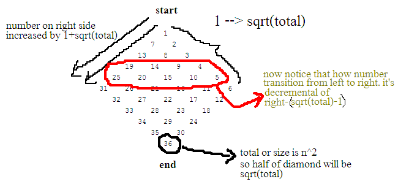

today i've encountered a simple yet tricky programming problem which is print a numeric diamond like this.

```
                  1
               7    2
            13    8    3
         19    14    9    4
      25    20    15    10    5
   31    26    21    16    11    6
      32    27    22    17    12
         33    28    23    18
            34    29    24
               35    30
                  36
```

at first glance it's look easy but it's a little bit tricky since the number order is from up to bottom and right to left. it's very different with this kind of numeric diamond

```
                  1
               2    3
             4    5    6
          7    8    9     10
      11   12    13    14    15
   16    17    18    19    20   21
      22    23    24    25    26
         27    28    29    30
            31    32    33
               34    35
                  36
```

so, after analyzing the number sequence i notice that the number order actually work like this diagram



after knowing how the number being ordered, now we can write our program. here's my solution. normally we use 2 times of loop when generating pyramid/diamond which is top and bottom triangle, but in this case we don't need to do that. see how easy to program something when you understand the algorithm.

```cpp
#include <stdio.h>
#include <math.h>
void diamond(int size) {
 int i,j,k,x;
 x = sqrt(size);
 int left,right=-1*x+1;
 for (i = 1; i < x*2 ;i++)
  {
   left = (i>x)?x*2-i:i;
   for (k=0;k<=x-left;k++) printf("   ");
   right = (i>x)?right+1:right+x;
   printf("%d",right);
   for (j = 1;j < left;j++) {
   printf("    %d",right-(x-1)*j);
   }
   printf("\n");
  }
}
int main() {
//input must be n^2
diamond(9);
diamond(36);
diamond(100);
diamond(121);
return 0;
}
```

[preview numeric diamonds output](http://codepad.org/y5S3MDnP#output)

if you have any other suggestion in term of better algorithm to solve this, feel free to drop your comment
